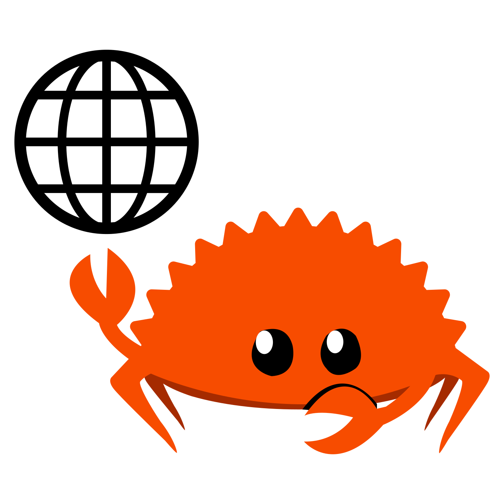

    

<h1 align="center">Rust For Web</h1>

Creates and ports web UI libraries for Rust.

Rust For Web is a collection of libraries designed for building web applications with Rust and WebAssembly. These libraries provide ready-to-use components for popular Rust web frameworks such as [Dioxus](https://dioxuslabs.com/), [Leptos](https://leptos.dev/), and [Yew](https://yew.rs/). Rust For Web is inspired by the rich ecosystems of JavaScript frameworks like React and aims to bring the same ease of use to the Rust web ecosystem. It achieves this by leveraging the strengths of existing JavaScript component libraries and porting their functionality to Rust.

## Documentation

See [the website](https://rustforweb.org).

## Credits

The logo is a combination of [Ferris the Rustacean](https://rustacean.net/) and [an internet icon](https://www.svgrepo.com/svg/478288/internet).

## License

This project is available under the [MIT license](LICENSE.md).
